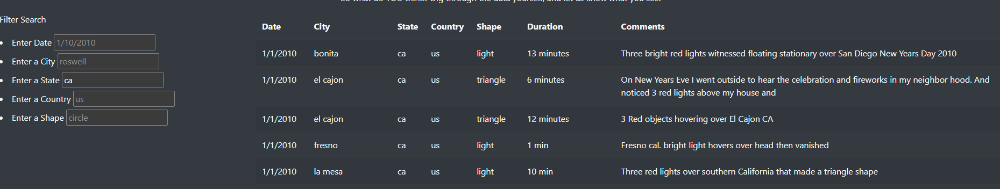

# UFO_Sightings_With_Javascript

## Overview of the analysis:

In this project, we are improving upon an existing web page that displays information on UFO sightings. We will be implementing multiple search filters to allow users to filter the table data based on date, city, state, country, and shape.

Overall, this project will provide an improved user experience for individuals seeking to view and analyze UFO sighting data. The added search filters will allow users to more easily identify trends and patterns in the data, providing a more in-depth analysis of UFO sightings.

## Results

### HOW TO SEARCH
1. Load the webpage by visiting the URL "file:///C:/Users/ssala/Class/Module_12/Starter_Code/index.html" in your web browser.

2. In the left-hand column, you will see the "Filter Search" section, which contains input fields for the date, city, state, country, and shape.

3. To filter the data by date, enter a date in the "Enter Date" input field. Press the "Enter" key, and the table will update to show only the data for that date.

4. To filter the data by city, enter a city name in the "Enter City" input field. Press the "Enter" key, and the table will update to show only the data for that city.

5. To filter the data by state, enter a state abbreviation in the "Enter State" input field. Press the "Enter" key, and the table will update to show only the data for that state.

6. To filter the data by country, enter a country name in the "Enter Country" input field. Press the "Enter" key, and the table will update to show only the data for that country.

7. To filter the data by shape, enter a UFO shape in the "Enter Shape" input field. Press the "Enter" key, and the table will update to show only the data for that shape.

You can also filter the data by multiple criteria at the same time. Simply enter values for each input field you want to use, and press the "Enter" key for each one. The table will update to show only the data that matches all of the search criteria.

To clear the search filters and show all of the data, simply refresh the webpage.

## Summary

Based on the analysis of the UFO sightings data, one major drawback of the current webpage is that it only allows for filtering on a limited number of criteria. While the current filters for date, city, state, country, and shape are useful, additional filters such as duration, sighting description, or weather conditions could provide more meaningful insights for users instead of providing a comment.

Two recommendations for further development of the webpage include adding a data visualization feature to allow users to easily view and compare data across multiple filters, and improving the user interface to make it more intuitive and user-friendly. Additionally, incorporating a machine learning model to predict and identify potential UFO sightings based on the data could provide a valuable tool for researchers and enthusiasts.
